# Procesflow — Activiteitenregistratie X-Factor

**Datum:** 2026-03-25
**Doel:** Volledig overzicht van alle processen per rol om optimalisatiepunten te identificeren.

---

## Rollen & kleurcode

| Kleur | Rol |
|-------|-----|
| 🔵 Blauw | Admin |
| 🟢 Groen | Docent |
| 🟡 Geel | Student |
| 🟣 Paars | Systeem (automatisch) |
| 🟠 Oranje | Beslissingsmoment |

---

## Volledige procesflow

```mermaid
flowchart TD
    classDef admin    fill:#dbeafe,stroke:#2563eb,color:#1e3a8a,font-weight:600
    classDef docent   fill:#dcfce7,stroke:#16a34a,color:#14532d,font-weight:600
    classDef student  fill:#fef9c3,stroke:#ca8a04,color:#713f12,font-weight:600
    classDef systeem  fill:#f3e8ff,stroke:#9333ea,color:#581c87,font-weight:600
    classDef beslis   fill:#fff7ed,stroke:#ea580c,color:#7c2d12,font-weight:700
    classDef einde    fill:#f1f5f9,stroke:#64748b,color:#334155,font-weight:600

    %% ══════════════════════════════════════════
    %% BLOK 1 — SETUP (eenmalig, door Admin)
    %% ══════════════════════════════════════════

    START([▶ Start]):::einde

    START --> A1[Admin: Opleiding aanmaken\nnaam · code · beschrijving]:::admin
    A1    --> A2[Admin: OpleidingTargets instellen\n5 beentjes × 4 niveaus per schooljaar]:::admin
    A2    --> A3[Admin: Gebruikers aanmaken\nstudenten · docenten]:::admin
    A3    --> A4[Admin: Docenten koppelen\naan opleiding · coördinator aanduiden]:::admin
    A4    --> A5{Auto-goedkeuring\nactiveren?}:::beslis
    A5 -->|Ja — student-activiteiten\nauto-goedgekeurd| KLAAR_SETUP
    A5 -->|Nee — handmatige\nvalidatie door docent| KLAAR_SETUP
    KLAAR_SETUP([Setup voltooid]):::einde

    %% ══════════════════════════════════════════
    %% BLOK 2 — ACTIVITEIT AANMAKEN (Docent)
    %% ══════════════════════════════════════════

    KLAAR_SETUP --> D1[Docent: Activiteit aanmaken\ntitel · datum · locatie · max. plaatsen]:::docent
    D1 --> D2[Docent: Beentje + niveau kiezen\nbijv. PASSIE niveau 2]:::docent
    D2 --> D3[Docent: Duurzaamheidsthema's koppelen\nbijv. SDG 4 · SDG 13]:::docent
    D3 --> D4{Publiceren?}:::beslis
    D4 -->|Concept bewaren| D1
    D4 -->|Publiceren| D5[Systeem: Status → gepubliceerd\nzichtbaar op prikbord]:::systeem

    %% ══════════════════════════════════════════
    %% BLOK 3A — PAD A: DOCENT-ACTIVITEIT
    %% Student schrijft in op bestaande activiteit
    %% ══════════════════════════════════════════

    D5 --> SA1[Student: Prikbord bekijken\ngefilterd op opleiding]:::student
    SA1 --> SA2[Student: Inschrijven op activiteit]:::student
    SA2 --> SA3[Systeem: Inschrijving aanmaken\nstatus → ingeschreven]:::systeem
    SA3 --> SA4{Activiteit\nvindplaats?}:::beslis
    SA4 -->|Max. plaatsen bereikt| SA_VOL[Inschrijving geblokkeerd\nwachtlijst optioneel]:::einde
    SA4 -->|Plaats vrij| SA5[Student neemt deel aan activiteit]:::student
    SA5 --> SA6{Aanwezig?}:::beslis
    SA6 -->|Nee| SA7[effectieveDeelname = false\nInschrijving gesloten]:::einde
    SA6 -->|Ja| SA8[Docent: effectieveDeelname = true]:::docent

    %% ══════════════════════════════════════════
    %% BLOK 3B — PAD B: EIGEN AANVRAAG
    %% Student dient zelf een activiteit in
    %% ══════════════════════════════════════════

    D5 --> SB1[Student: Aanvraag indienen\neigen activiteit]:::student
    SB1 --> SB2[Student: Beentje + niveau kiezen\nbijv. REFLECTIE niveau 1]:::student
    SB2 --> SB3[Systeem: typeAanvraag = student_aanvraag\nstatus → in_review]:::systeem
    SB3 --> SB4{Docent beoordeelt\naanvraag}:::beslis
    SB4 -->|Afgekeurd| SB5[Student ontvangt afkeuring\nkan nieuwe aanvraag indienen]:::einde
    SB4 -->|Goedgekeurd\nbijv. beentje aanpassen| SB6[Systeem: Status → goedgekeurd\nActiviteit gepubliceerd]:::systeem
    SB6 --> SA8

    %% ══════════════════════════════════════════
    %% BLOK 4 — BEWIJS INDIENEN & BEOORDELEN
    %% ══════════════════════════════════════════

    SA8 --> BW1[Student: Bewijsstuk indienen\nfoto · PDF · link]:::student
    BW1 --> BW2[Systeem: bewijsStatus → ingediend]:::systeem
    BW2 --> BW3[Docent: Bewijsstuk beoordelen]:::docent
    BW3 --> BW4{Goedgekeurd?}:::beslis
    BW4 -->|Afgekeurd + feedback| BW5[Student ontvangt feedback\nkan opnieuw indienen]:::student
    BW5 --> BW1
    BW4 -->|Goedgekeurd| BW6[Systeem: bewijsStatus → goedgekeurd]:::systeem

    %% ══════════════════════════════════════════
    %% BLOK 5 — VOORTGANG & SCOREKAART
    %% ══════════════════════════════════════════

    BW6 --> V1[Systeem: recalculateStudentVoortgang\ntelt goedgekeurde activiteiten\nper beentje × niveau]:::systeem
    V1  --> V2[Systeem: StudentVoortgang bijgewerkt\naantalPassieN1 · aantalReflectieN2 · …]:::systeem
    V2  --> V3[Student: Scorekaart bekijken\nX-Factor visual · progress bars]:::student
    V3  --> V4[Docent / Admin:\nScorekaart student inzien]:::docent

    %% ══════════════════════════════════════════
    %% BLOK 6 — BEHEER (Admin/Docent, parallel)
    %% ══════════════════════════════════════════

    KLAAR_SETUP --> BH1[Admin: Activiteiten beheren\nstatus wijzigen · archiveren]:::admin
    BH1 --> BH2[Admin: Gebruikers beheren\nimpersonation · opleiding wijzigen]:::admin
    BH2 --> BH3[Admin: Targets aanpassen\nper schooljaar]:::admin
```



---

## Geïdentificeerde knelpunten & optimalisatiepunten

### 🔴 Hoog risico / veel handmatig werk

| # | Knelpunt | Huidig | Voorstel |
|---|----------|--------|----------|
| 1 | **Deelname bevestiging** | Docent moet per student `effectieveDeelname = true` zetten | Bulk-actie per activiteit ("markeer alle aanwezigen in één klik") |
| 2 | **Bewijsstuk beoordeling** | Elk bewijs individueel beoordelen | Bulk goedkeuring voor activiteiten waarbij aanwezigheid al bevestigd is |
| 3 | **Geen notificaties** | Student weet niet wanneer aanvraag/bewijs beoordeeld is | E-mail of in-app notificatie bij statuswijziging |

### 🟠 Procesvertraging

| # | Knelpunt | Huidig | Voorstel |
|---|----------|--------|----------|
| 4 | **Pad B heeft 4+ handmatige stappen** | aanvraag → goedkeuring → deelname → bewijs → beoordeling | Aanvraag + bewijs samenvoegen in één stap bij eenvoudige activiteiten |
| 5 | **Verlopen activiteiten** | Geen automatische archivering | Systeem archiveert automatisch 7 dagen na datum |
| 6 | **Voortgang herberekening** | Getriggerd bij elke bewijsgoedkeuring | Werkt goed, maar geen zichtbare "laatste update" voor student |

### 🟡 Gebruikerservaring

| # | Knelpunt | Huidig | Voorstel |
|---|----------|--------|----------|
| 7 | **Bewijs opnieuw indienen** | Student kan opnieuw indienen maar geen duidelijke feedback-loop | Toon feedback prominent + markeer welk bewijs afgekeurd was |
| 8 | **Targets per schooljaar** | Admin moet targets elk jaar opnieuw instellen | "Kopieer targets van vorig schooljaar" knop |
| 9 | **Prikbord** | Toont alle gepubliceerde activiteiten | Filter op beentjes die student nog niet heeft behaald |

---

## Datamodel — statussen per entiteit

```
Activiteit.status:      concept → gepubliceerd → gearchiveerd
Activiteit.typeAanvraag: docent_activiteit | student_aanvraag

Inschrijving.inschrijvingsstatus: ingeschreven | uitgeschreven
Inschrijving.effectieveDeelname:  false → true (handmatig door docent)
Inschrijving.bewijsStatus:        niet_ingediend → ingediend → goedgekeurd → afgekeurd
```
